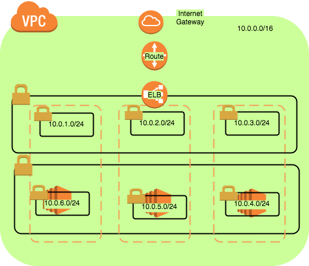

# Purpose
The outcome of this exercise is to use required tools to generate the set of resources on AWS as per the guidelines provided to me (see requirements below).

# Requirements
```
Using the method of your choice, write automation to create the following web application
stack. You should submit your automation assets that we can run to provision the environment.
If you have any questions then just make your best guess at our intent and note any
assumptions you've made when submitting your assets.
1. Create an ELB
a. Listen on
i. HTTP Port 80
ii. HTTPS Port 443
1. Terminate SSL here
2. Create 3 “t2.micro” EC2 instances
a. use ami-5e63d13e
i. uses "ubuntu" as user name for ssh
b. in us-west-2 region
c. 2 of the instances must be configured as a web server using web server software
of your choice:
i. apache
ii. nginx
iii. node.js
iv. tomcat
v. tornado
vi. etc
d. The 3rd instance must be configured as a web server using different software
from the other 2 (e.g. if the first 2 use apache, this one uses nginx)
e. All 3 web servers must be configured as follows
i. listen on port 8900 for HTTP
ii. Web access logs configured to write to /var/log/tdcustom/accesslogs/
iii. Web servers must not be running as root
iv. Web servers must return a "hello world!" type page

3. Register all 3 EC2 web servers with ELB created in step 1
4. Networking:
a. Your laptop should be able to ssh into the instances
b. 141.206.246.10/32 should be able to ssh into the instances
c. The ELB should be forwarding web requests to hosts over port 8900
d. Port 8900 should only be accessible by the ELB
e. All other host ports not specified shouldn’t be accessible

Additional instructions:
• Feel free to create VPC's/subnets/ssh keys/etc as required to complete your project
• Your submission should be runnable code either in chef / ansible/ bash/ python/
cloudformation/ etc.
```

# Approach
I have chosen Terraform to configure and deploy infrastructure resources on AWS. This is a personal choice but I feel that Terraform provides easy maintenance and readability as it is quite modular. I have also interacted with Terraform community and found that it is quite vibrant and helpful (https://github.com/hashicorp/terraform/issues).

# Features
1. Seperation of public and private subnets
2. Use of autoscaling groups to enhance high availability
3. Flexibility to add additional capacity
4. Easily replicate to other regions

# Assumptions
1. Given direct access to ec2 (according to instructions) instances but preserved best practice to house them in a private subnet. In reality, use of bastoin hosts and a adequate key rotation policy is needed
2. Created a self signed certificate to demonstrate the ability to offload ssl at ELB.
3. Used public key from my personal laptop to create a keypair

# Architecture


# Directory structure
```
├── environment
│   └── development
│       ├── main.tf
│       └── variables.tf
├── resources
│   ├── ec2
│   │   ├── main.tf
│   │   ├── outputs.tf
│   │   └── variables.tf
│   ├── elb
│   │   ├── main.tf
│   │   ├── outputs.tf
│   │   └── variables.tf
│   └── vpc
│       ├── main.tf
│       ├── outputs.tf
│       └── variables.tf
├── scripts
│   ├── create_apache.sh
│   ├── create_nginx.sh

```
# Usage
1. Install terraform - follow instructions here - https://www.terraform.io/
2. Create a s3 bucket and make sure the account used to deploy has read write privileges
3. Edit ~/.aws/credentials file and add key and secret to the ```[default]``` section
4. Clone the repository and cd to ```<parent folder>/environments/development``` folder
5. run ```terraform init``` - follow prompts
6. run ```terraform plan``` - validate the output
7. run ```terraform apply``` - to apply changes
8. run ```terraform destroy`` - to destroy

# Terraform plan
```
aws_key_pair.deployer: Refreshing state... (ID: deployer-key)
aws_default_vpc.default: Refreshing state... (ID: vpc-2e405448)
aws_vpc.main: Refreshing state... (ID: vpc-6ca7b30a)
aws_eip.eip[0]: Refreshing state... (ID: eipalloc-05df9238)
aws_eip.eip[2]: Refreshing state... (ID: eipalloc-b1df928c)
aws_eip.eip[1]: Refreshing state... (ID: eipalloc-62de935f)
aws_security_group.private_security_group: Refreshing state... (ID: sg-7f1ee503)
aws_internet_gateway.gw: Refreshing state... (ID: igw-26f6eb41)
aws_security_group.public_security_group: Refreshing state... (ID: sg-f61de68a)
aws_subnet.private[0]: Refreshing state... (ID: subnet-4f93ce29)
aws_subnet.private[1]: Refreshing state... (ID: subnet-1475644f)
aws_route_table.private_route_table: Refreshing state... (ID: rtb-ce86d7b7)
aws_subnet.private[2]: Refreshing state... (ID: subnet-ea7564b1)
aws_subnet.public[1]: Refreshing state... (ID: subnet-4e93ce28)
aws_subnet.public[0]: Refreshing state... (ID: subnet-f5423fbd)
aws_subnet.public[2]: Refreshing state... (ID: subnet-52796809)
aws_launch_configuration.as_conf_nginx: Refreshing state... (ID: lc-nginx20171128061806601300000002)
aws_launch_configuration.as_conf_apache: Refreshing state... (ID: lc-apache20171128061806581900000001)
aws_route.private_route[1]: Refreshing state... (ID: r-rtb-ce86d7b71080289494)
aws_route.private_route[2]: Refreshing state... (ID: r-rtb-ce86d7b71080289494)
aws_route.private_route[0]: Refreshing state... (ID: r-rtb-ce86d7b71080289494)
aws_elb.elb: Refreshing state... (ID: elbpublic)
aws_autoscaling_group.asg_resource_apache: Refreshing state... (ID: auto_scaling_group_apache)
aws_autoscaling_group.asg_resource_nginx: Refreshing state... (ID: auto_scaling_group_nginx)
aws_autoscaling_policy.policy_apache: Refreshing state... (ID: asg_policy_apache)
aws_autoscaling_policy.policy_nginx: Refreshing state... (ID: asg_policy_nginx)
aws_autoscaling_attachment.asg_attachment_nginx: Refreshing state... (ID: auto_scaling_group_nginx-20171128005150598300000002)
aws_autoscaling_attachment.asg_attachment_apache: Refreshing state... (ID: auto_scaling_group_apache-20171128005150596800000001)
```
